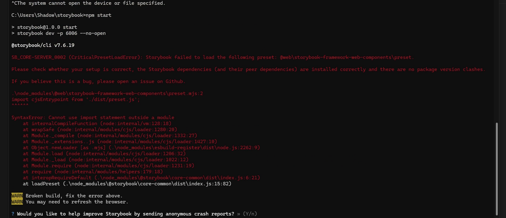

# Instructions

On a windows machine:
```
git clone https://github.com/thepassle/sb-windows-repro.git
cd sb-windows-repo
npm i
npm start
```

**Expected:**
Storybook boots up as normal and shows the story

**Actual:**
An error is shown:
